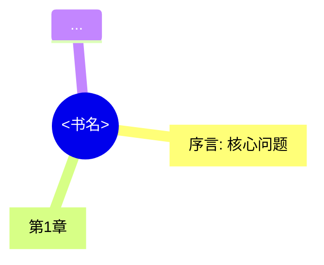
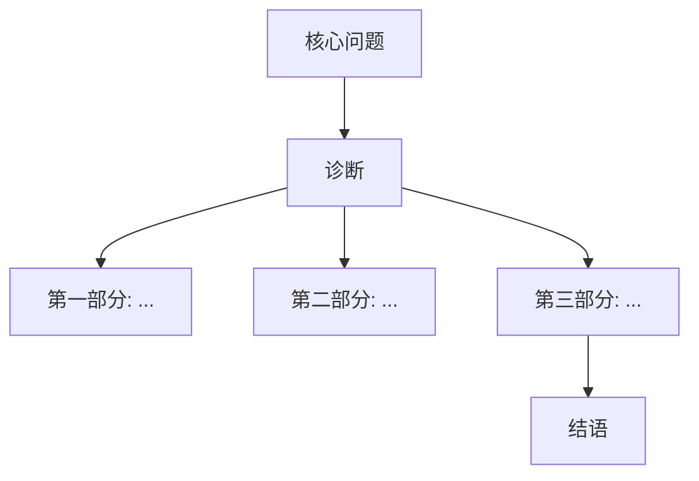
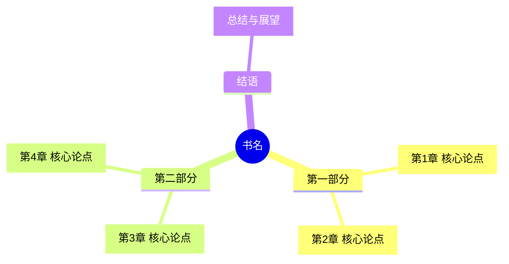

# Book Note Maker — 读书笔记生成器 v2.0

## Overview

当用户上传 PDF 书籍文件并请求系统性读书笔记时，该技能指导你：
1. **智能文本提取** — 自动识别文本型 PDF vs 扫描版 PDF，选择合适的提取路径
2. **多语言章节检测** — 支持中文、英文、中英双语混杂三种模式的章节边界检测
3. **逐章四段式分析** — 为每个章节提取：**核心论点、关键概念表、典型案例、金句摘录**
4. **Auto-Mermaid Mindmap** — 自动生成全书逻辑框架的 Mermaid 思维导图
5. **七大板块组装** — 输出结构化 Markdown 文件保存到 `<书名>_读书笔记.md`

### 文本提取决策树

```
PDF 上传
  ├── 尝试 pypdf 提取文本
  │   ├── 成功且字数量 ≥ 页数×100 → 文本型 PDF → 继续处理
  │   └── 失败或字数量 < 页数×20 → 扫描版 PDF → 进入 OCR 流程
  │                                         ├── marker-pdf 可用 → 执⾏ OCR
  │                                         └── marker-pdf 不可用 → 告知用户需要 OCR 空间
  ├── 输出: /tmp/book_full_text.txt
  └── 进入章节检测阶段
```

---

## When to Use

- **触发条件**：用户上传 PDF 文件（`.pdf`）并说"帮我做读书笔记"、"梳理这本书"、"分析这本书"、"做成笔记"、"提炼精华"
- **支持场景**：
  - 中文书籍（章节标题如"第一章"、"第二章"）
  - 英文书籍（章节标题如"Chapter 1"、"Part I"）
  - **中英双语混合书籍**（学术著作、教材等）
  - **扫描版 PDF**（纯图片，需 OCR）
  - 478页以内中等厚度书籍（已验证500页/50万字级别）
- **不要用于**：
  - 短篇文章/论文（直接读全文即可，章节分解不必要）
  - 用户仅需要摘要而非结构化笔记

---

## 执行流程

### 阶段一：环境准备与智能文本提取

```python
from hermes_tools import terminal, read_file, search_files, write_file, patch

# 1. 确保 pypdf 可用
terminal("uv pip install pypdf --quiet", timeout=60)

# 2. 尝试 pypdf 文本提取
text = terminal(f'python3 -c "
import pypdf
reader = pypdf.PdfReader(\"{pdf_path}\")
full_text = \"\"
for i, page in enumerate(reader.pages):
    txt = page.extract_text()
    if txt:
        full_text += txt + \"\\n\"
with open(\"/tmp/book_full_text.txt\", \"w\", encoding=\"utf-8\") as f:
    f.write(full_text)
print(f\"CHARS:{len(full_text)}\")
print(f\"PAGES:{len(reader.pages)}\")
"', timeout=120)

# 解析输出
lines = text.split('\n')
chars = int([l for l in lines if l.startswith('CHARS:')][0].split(':')[1])
pages = int([l for l in lines if l.startswith('PAGES:')][0].split(':')[1])

# 3. 判断是否扫描版 PDF
if chars < pages * 20:
    # 扫描版 PDF → 进入 OCR 流程（参见 references/pdf-extraction-recipe.md）
    print(f"Detected scanned PDF ({chars} chars for {pages} pages). Starting OCR...")
    # 方案A: 尝试 marker-pdf
    marker_ok = terminal("which marker_single 2>/dev/null && echo YES || echo NO", timeout=10)
    if marker_ok.strip() == "YES":
        terminal("marker_single \"{pdf_path}\" --output_dir /tmp/book_ocr/ --languages zh,en", timeout=600)
    else:
        # 方案B: 提示用户
        print("OCR requires marker-pdf (~3-5GB). Install: uv pip install marker-pdf")
        print("Fallback: using pypdf extracted text as-is (may be sparse).")
```

### 阶段二：获取元数据

```python
reader = pypdf.PdfReader(pdf_path)
meta = reader.metadata
# 提取: /Title, /Author, /CreationDate, /Producer, /Subject
```

### 阶段三：多语言章节检测（双语增强版）

检测引擎按以下优先级扫描章节边界，支持单语言和中英双语混杂：

| 优先级 | 模式 | 适用场景 | 正则示例 |
|--------|------|---------|---------|
| **A** | 中文数字章节（章/课） | 纯中文书籍 | `第[一二三四五六七八九十百零]+[章课]` |
| **A2** | 中文数字章节（带空格） | 中文书籍（跨页断裂） | `第\s*[一二三四五六七八九十百零]+\s*[章课]` |
| **B** | 中文阿拉伯数字章节 | 中文章节 | `第\d+章` |
| **C** | 英文 Chapter | 纯英文书籍 | `Chapter\s+\d+` |
| **D** | Part 分卷 | 大部头书籍 | `Part\s+[IVXLCDM]+` |
| **E** | 英文数字章节(含标点变体) | 双语书籍 | `C[hH][aApPtTeErR]*\.?\s*\d+` |
| **F** | 中文或英文小节标题 | 混合书籍 | `第[一二三四五六七八九十百零]+节` 或 `Section\s+\d+` |
| **G** | 全大写行 | 无标准章节号的书籍 | `^[A-Z \.\-\d]{5,}$` |
| **H** | 中文课程序列(第X课) | 教科书/训练书 | `第\s*\d+\s*课` |
| **I** | 连续三个及以上空行 | 终极回退 | `\n\n\n\n` |

**重要：对话式/教科书类中文书籍的特殊处理**

这类书籍（如对话体、思辨训练类）有一个常见陷阱：文中会大量出现对其他章节的交叉引用（如"第3课中提到的..."、"第1课学过的..."），这些不是真正的章节标题，但会被普通正则匹配捕获为假阳性。

**应对策略**：在初次章节检测后，对候选结果进行两轮过滤：

1. **行长度过滤**：只保留匹配到章节模式但整行字符数 ≤ 25 的候选（真正章节标题通常独立成行且较短）
2. **上下文过滤**：检查候选行的前一行——如果前一行是空行（''）或仅含页码（匹配 `^\d+$`），则确认为真实章节标题；如果前一行包含连续文字，则很可能是交叉引用，予以排除

```python
# 对话式书籍的假阳性过滤
genuine_chapters = []
for title, line_no, label in lesson_candidates:
    stripped = title
    # 过滤：只保留短行（≤25字）
    if len(stripped) > 25:
        continue
    # 检查章节模式
    if re.match(r'第\s*[一二三四五六七八九十\d]+\s*[章课]', stripped):
        # 检查前一行是否为空白或页码
        prev_line = lines[line_no-1].strip() if line_no > 0 else ''
        if prev_line == '' or re.match(r'^\d+$', prev_line) or len(prev_line) < 5:
            genuine_chapters.append((stripped, line_no, label))
```

**诊断信号**：如果初次检测出的章节数 > 30 且大部分匹配来自正文中的交叉引用（如"第3课中提到的..."这种长句），立即启动上述假阳性过滤流程。

**双语书籍特殊处理**：如果模式 A（中文数字）和模式 C（英文 Chapter）各自检测到 ≥2 个匹配，合并两个结果集并按位置排序。

**执行代码**：

```python
import re

with open('/tmp/book_full_text.txt', 'r', encoding='utf-8') as f:
    text = f.read()
lines = text.split('\n')

# ===== 多模式匹配 =====
patterns = [
    # A: 中文数字章节
    (r'第[一二三四五六七八九十百零]+章\s*[^\n]*', 'cn_num章'),
    # B: 中文阿拉伯数字章节
    (r'第\d+章\s*[^\n]*', 'cn_digit章'),
    # C: 英文 Chapter
    (r'[Cc][Hh][Aa][Pp][Tt][Ee][Rr]\s+\d+[^\n]*', 'en_chapter'),
    # D: Part 分卷
    (r'[Pp][Aa][Rr][Tt]\s+[IVXLCDM\d]+[^\n]*', 'en_part'),
    # E: 混合变体
    (r'[Cc][Hh][Aa][Pp]\.?\s*\d+[^\n]*', 'en_variant'),
    # F: 英文数字标题 (e.g., "1. Introduction", "2. Background")
    (r'^\d+\.\s+[A-Z][^\n]{3,}', 'en_numbered'),
]

all_matches = []
matched_patterns = set()

for pattern, label in patterns:
    if text[:3] != '\ufeff':  # handle BOM
        pass
    # 先在逐行文本中匹配
    for i, line in enumerate(lines):
        line_stripped = line.strip()
        m = re.search(pattern, line_stripped)
        if m:
            all_matches.append((m.group().strip(), i, label))
            matched_patterns.add(label)
    
    # 如果逐行匹配不足，在平铺文本中搜索
    if len([m for m in all_matches if m[2] == label]) < 2:
        flat_text = text.replace('\n', '')
        for m in re.finditer(pattern, flat_text):
            # 估算在原文本中的行号
            approx_pos = m.start()
            line_no = flat_text[:approx_pos].count('\n') if '\n' in text else approx_pos // 80
            all_matches.append((m.group().strip(), line_no, label))
            matched_patterns.add(label)
```

**双语合并策略**：

```python
# 检测双语混合模式
cn_matches = [m for m in all_matches if 'cn' in m[2]]
en_matches = [m for m in all_matches if 'en' in m[2]]

if len(cn_matches) >= 2 and len(en_matches) >= 2:
    # 双语书籍：合并中英文章节并按位置排序
    merged = cn_matches + en_matches
    merged.sort(key=lambda x: x[1])
    final_chapters = merged
    is_bilingual = True
else:
    # 单一语言
    if len(cn_matches) >= len(en_matches):
        final_chapters = sorted(cn_matches, key=lambda x: x[1])
    else:
        final_chapters = sorted(en_matches, key=lambda x: x[1])
    is_bilingual = False

# 添加已知章节前缀（序言/前言/引言等）
for keyword in ['序言', '前言', '引言', 'Preface', 'Introduction', 'Prologue']:
    for i, line in enumerate(lines):
        if keyword in line and i < len(lines) * 0.15:
            final_chapters.insert(0, (keyword, i, 'front_matter'))
            break

# 去重（相同行附近的合并）
seen_lines = set()
deduped = []
for title, line_no, label in final_chapters:
    bucket = line_no // 5  # 5行内的视为同一个章节
    if bucket not in seen_lines:
        seen_lines.add(bucket)
        deduped.append((title, line_no, label))
final_chapters = deduped
```

**终极回退（没有任何模式匹配到 ≥2 个章节时）**：

```python
if len(final_chapters) < 2:
    # 按连续空行分节
    sections = re.split(r'\n{4,}', text)
    final_chapters = [(f"Section {i+1}", 0, 'fallback') for i in range(min(len(sections), 30))]
```

### 阶段四：全书分块存储

```python
chunk_size = 50000
chunks_dir = '/tmp/book_chunks/'
import os, math
os.makedirs(chunks_dir, exist_ok=True)

num_chunks = math.ceil(len(text) / chunk_size)
for i in range(num_chunks):
    start = i * chunk_size
    end = min((i + 1) * chunk_size, len(text))
    chunk_text = text[start:end]
    line_offset = text[:start].count('\n')
    with open(f'{chunks_dir}chunk_{start}.txt', 'w', encoding='utf-8') as f:
        f.write(f'--- CHUNK START={start}, LINE_OFFSET={line_offset} ---\n')
        f.write(chunk_text)
```

### 阶段五：跨文件章节内容检索

```python
# 搜索来源关键词
result = terminal("grep -A2 -B2 '比如\\|例如\\|举例来说' /tmp/book_chunks/chunk_*.txt | head -80", timeout=30)

# 搜索结论关键词
result = terminal("grep -A2 '因此\\|由此可见\\|总之\\|所以' /tmp/book_chunks/chunk_*.txt | head -40", timeout=30)

# 搜索引用
result = terminal("grep -A1 '正如\\|指出\\|认为' /tmp/book_chunks/chunk_*.txt | head -40", timeout=30)
```

### 阶段六：逐章节内容提取与四段式分析

```python
for title, line_no, label in final_chapters:
    # 找到对应的 chunk 文件
    approx_offset = line_no * 80  # 估算字符偏移
    for chunk_start in range(0, len(text), 50000):
        if chunk_start <= approx_offset < chunk_start + 50000:
            chunk_file = f'/tmp/book_chunks/chunk_{chunk_start}.txt'
            local_line = line_no - text[:chunk_start].count('\n'
            content = read_file(chunk_file, offset=max(1, local_line-2), limit=120)
            break
    
    # 分析四个维度
    # 1. 核心论点 — 章节开头段落
    # 2. 关键概念 — 术语表
    # 3. 典型案例 — 搜索"比如"、"例如"附近段落
    # 4. 金句 — 搜索论述性段落中的亮点
```

---

### 阶段七：Auto-Mermaid 思维导图生成

> **新增**：笔记包含自动生成的 ````mermaid` 思维导图

```python
def generate_mindmap(chapters, book_title, is_bilingual=False):
    """
    从章节结构自动生成 Mermaid mindmap 代码
    """
    lines = []
    lines.append(f"mindmap")
    lines.append(f"  root(({book_title}))")
    
    # 检测大分区（Part I, Part II 或自然分组）
    parts = []
    current_part = None
    for title, line_no, label in final_chapters:
        if 'Part' in title or '部分' in title or '篇' in title:
            current_part = title.strip()
            parts.append({'part': current_part, 'chapters': []})
        elif current_part:
            parts[-1]['chapters'].append(title)
        else:
            # 没有大分区，直接添加章节
            clean_title = title.replace('第', '').replace('章', ': ')[:40]
            lines.append(f"    [{clean_title}]")
    
    if parts:
        for part in parts:
            p_name = part['part'][:30]
            lines.append(f"  ({p_name})")
            for ch in part['chapters']:
                clean = ch.replace('第', '').replace('章', ': ')[:40]
                lines.append(f"    [{clean}]")
    
    # 添加结论节点
    lines.append(f"  [结语/总结]")
    
    return '\n'.join(lines)
```

**Mermaid 支持两种图表类型**：

| 类型 | 适用于 | 示例 |
|------|--------|------|
| `mindmap` | 快速概览（推荐） | `mindmap\n  root((书名))\n    [第1章]` |
| `graph TD` | 带箭头的逻辑链 | `graph TD\n  A[问题] --> B[诊断]` |

### 阶段八：组装笔记并保存

- 加载 `templates/note-structure.md` 获取输出框架
- 填充每个章节的四段式分析结果
- 插入自动生成的 Mermaid 思维导图到"全书逻辑框架"部分
- 提取标注信息（is_bilingual、是否OCR等）
- 保存为 `<书名>_读书笔记.md` 并告知用户路径

---

## 笔记输出模板

参考 `templates/note-structure.md`。最终笔记结构如下：

```markdown
# 📖 <书名> 读书笔记

**作者**：XXX | **译者**：XXX | **出版社**：XXX  | **ISBN**：XXXXXXXX
**提取方式**：文本型PDF ✅ / 扫描版OCR ✅ | **语言**：中文 / 英文 / 双语
**页数**：XXX页 | **笔记日期**：YYYY-MM-DD

---

## 一、全书逻辑框架鸟瞰



**核心命题**：...

---

## 二、章节精读笔记

### [序言] <标题>

#### 核心论点
- ...
#### 关键概念表
| 概念 | 定义 | 举例 |
|------|------|------|
#### 典型案例
**案例1：...**
- 背景/过程/论证作用/应用场景
#### 金句摘录
> "..."（第X章）

### [第1章] ...
...

---

## 三、论证链总结图（Mermaid graph）



---

## 四、金句精选
## 五、延伸阅读推荐
## 六、快速查阅索引
```

---

## 关键技术参考

### OCR 流程（扫描版 PDF）

详见 `references/pdf-extraction-recipe.md` 的完整 OCR 章节。

**快速决策**：

```
pypdf 提取文本字数量 < 页数×20 ?
  ├── YES → 扫描版PDF
  │    ├── marker-pdf 已安装 → marker_single --languages zh,en
  │    └── 未安装 → "需要 marker-pdf: uv pip install marker-pdf (需~5GB)"
  └── NO → 文本型PDF，继续
```

### 双语书籍特殊处理

| 问题 | 对策 |
|------|------|
| 中英文章节标题混排（中"第一章" + 英"Chapter 1"） | 两种模式同时搜索，合并去重 |
| 英文书名中的中文标点（引号、括号等） | 平铺文本 `replace('\\n','')` 后再匹配 |
| CJK 字符与 Latin 字符混排 | 不依赖纯字母标题模式，优先中文数字章节模式 |
| 英文专有名词跨行断裂 | `line.replace('-\\n', '')` 修复连字符断裂 |

### Mermaid 图表生成规则



- 如果检测到 Part/篇/部分 分区 → 用 `()` 创建子树
- 如果无分区 → 直接平铺 `[]` 节点
- 最终自动追加结语/总结节点

---

## Common Pitfalls

1. **pypdf 提取文本质量差（换行断裂、乱码）**：中文 PDF 尤其严重。对策：用 `text.replace('\\n','')` 平铺后再用正则匹配章节；部分乱码可忽略。

2. **扫描版 PDF 误判为文本型**：OCR 输出可能混入乱码字符。对策：检查 `chars < pages×20` 条件，考虑用 `len(re.findall(r'[\\u4e00-\\u9fff]', text)) < pages×5` 更准确判断中文扫描版。

3. **章节检测失败/双语混合**：如果中文 + 英文模式各自只命中 1-2 个，合并后仍然不够。终极回退：按连续 4+ 换行或页数均分。

4. **注释/参考文献混入正文**：检测到"注释"、"参考文献"、"索引"、"附录"标题后，标记为单独章节，不按正文章节分析。参考文献通常包含大量作者姓名 → 适当减少最后一章的分析量。

5. **Python 依赖问题**：系统 pip 可能因 PEP 668 拒绝安装。统一使用 `uv pip install`（预装在 hermetic venv 中）。marker-pdf 需要 ~5GB 存储空间安装 PyTorch 和模型。

6. **Mermaid 渲染长度限制**：超过 40 个章节的 Mermaid 图表可能在某些渲染器中断裂。对策：超过 30 章时用 `graph TD` 替代 `mindmap`，或按部分/A/B分组生成多个子图。

7. **BOM 头问题**：某些 PDF 提取的文本开头包含 `\\ufeff`（BOM），在章节匹配前用 `text.lstrip('\\ufeff')` 清理。

8. **同一章节内容过长**：采用"两步法"——先读章节开头 100 行获取核心论点，再搜索"例如/比如"查找案例，最后搜索"因此/由此可见/总之"等词定位关键结论。

9. **对话式/教科书类中文书籍的假阳性章节**：这类书籍（如对话体思维训练书、教科书）会在正文中大量出现对其他章节的交叉引用（"第3课中提到的..."、"第1课学过的技巧"），导致普通正则匹配检测出数十个假章节标题。对策：
   - 先执行标准的多模式匹配 → 如果检测到章节数 > 30 且大部分匹配来自正文长句 → 启动"短行+上下文过滤"流程
   - 只保留字符数 ≤ 25 的短行候选
   - 检查候选行前一行是否为空行或纯页码（`^\d+$`）
   - 真实章节标题周围通常有页码分隔和空行环绕
   - 另外，目录页（"本书内容"、"目录"等）也会列出所有章节——在目录区内的匹配应识别为目录引用而非真正章节，真正章节的位置在目录之后更深处

10. **大型书籍的并行提取**：对于 200+ 页、内容丰富的书籍，逐章串行提取效率低。可采用 delegate_task 并行分发各章节的分析任务。注意：max_concurrent_children 默认为 3，因此需要分批（如第一批3章，第二批2章）。每批的分析结果会返回结构化 markdown，笔记组装阶段合并即可。

---

## 扩展阅读

- `references/pdf-extraction-recipe.md` — PDF 提取、OCR 流程、章节检测的完整代码实现
- `references/dialog-chinese-book-detection.md` — 对话式/教科书类中文书籍章节检测的假阳性过滤技术（含上下文感知过滤代码）
- `templates/note-structure.md` — 完整的七大板块输出模板（含 Mermaid 示例）
- `scripts/parallel-chapter-extract.py` — 大型书籍（200+页）的并行章节提取脚本（支持 delegate_task 分批调度）
- 扫描版 PDF 扩展：参见 `ocr-and-documents` 技能的 `marker-pdf` 章节
- 类似技能：`ocr-and-documents`（文本提取 → 其 `references/chunked-analysis.md` 有通用的大文档 grep 分析模式）、`meeting-minutes`（公文排版）

---

## Verification Checklist

- [ ] **文本提取**：文本型 PDF 提取字数量 ≥ 页数×80%；扫描版 PDF 正确触发 OCR 流程
- [ ] **章节检测**：≥ 书籍实际章节数的 80%（常见：10-15 章 + 序言/结语，检测到 ≥ 10 个节点）
- [ ] **双语检测**：章节检测结果正确混合了中文和英文章节标题（如果是双语书）
- [ ] **Mermaid 生成**：笔记中包含 `mindmap` 或 `graph TD` 块，节点数合理（5-30）
- [ ] **四段式分析**：每章都有「核心论点」「关键概念」「典型案例」「金句」四部分
- [ ] **案例标注**：每个案例标注了论证作用和应用场景
- [ ] **金句标注**：每句金句标注了归属章节
- [ ] **OCR 标注**：扫描版 PDF 的笔记开头标注了"提取方式：扫描版OCR"
- [ ] **双语标注**：双语书籍的笔记开头标注了"语言：中英双语"
- [ ] **文件保存**：笔记文件路径明确告知用户
