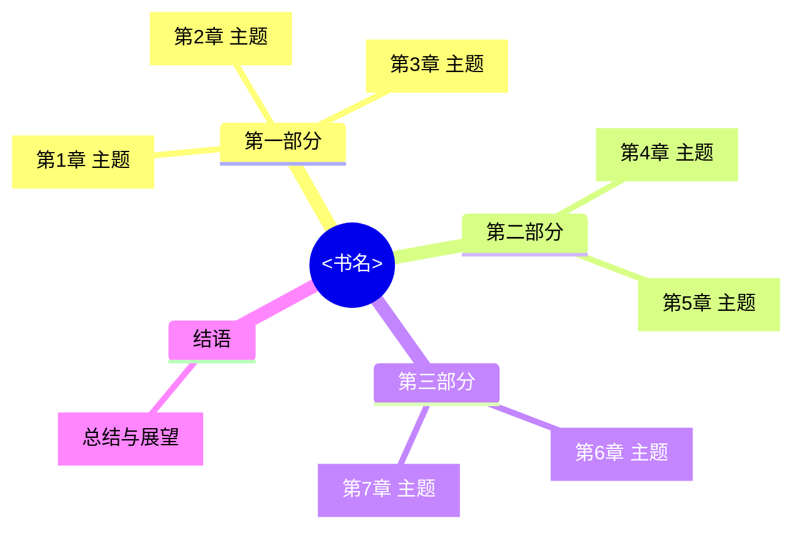
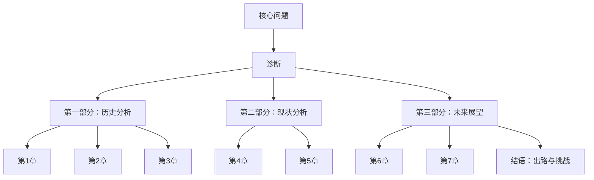

# 📖 <书名> 读书笔记

**作者**：［国籍］作者名 | **译者**：译者名 | **出版社**：出版社名
**出版日期**：YYYY-MM-DD | **ISBN**：XXXXXXXXXX
**提取方式**：文本型PDF ✅ / 扫描版OCR ✅ | **语言**：中文 / 英文 / 中英双语
**页数**：XXX页 | **笔记日期**：YYYY-MM-DD

---

## 一、全书逻辑框架鸟瞰

**全书核心命题**：
> 一句话概括全书的核心论点、问题意识和最终结论。

**核心问答**：

| 核心问题 | 答案 |
|---------|------|
| 我们要解决什么问题？ | ... |
| 作者给出了什么诊断？ | ... |
| 最终的呼吁或建议？ | ... |

---

## 二、章节精读笔记

---

### [序言] <标题>

#### 核心论点

- **问题**：
- **核心悖论**：
- **全书主线**：

#### 关键概念表

| 概念 | 定义/内涵 | 举例 |
|------|-----------|------|
| 概念A | | |
| 概念B | | |

#### 典型案例

**案例1：<名称>**
- **背景**：何时何地、涉及谁
- **过程**：发生了什么
- **论证作用**：说明什么观点
- **应用场景**：还能用在什么语境

#### 金句摘录

> "原文引文"

---

### [第1章] <标题>

#### 核心论点

...

#### 关键概念表

...

#### 典型案例

...

#### 金句摘录

...

---

（重复上述结构至所有章节）

---

## 三、论证链总结图

**逻辑链路说明**：
1. 全书从（问题）出发 →
2. 通过（论证路径）→
3. 得出（核心结论）

---

## 四、金句精选

1. > "金句1" — 序言
2. > "金句2" — 第1章
3. > "金句3" — 第3章

---

## 五、延伸阅读推荐

| 关联书目 | 作者 | 关联点 | 推荐理由 |
|---------|------|--------|---------|
| 《书名》 | 作者 | 本书的... | ... |
| 《书名》 | 作者 | 与第X章呼应 | ... |

---

## 六、快速查阅索引

| 主题 | 相关章节 | 关键词 |
|-----|---------|--------|
| 主题A | 第1/2章 | 关键词 |
| 主题B | 第3/5章 | 关键词 |
| 主题C | 第6-8章 | 关键词 |
